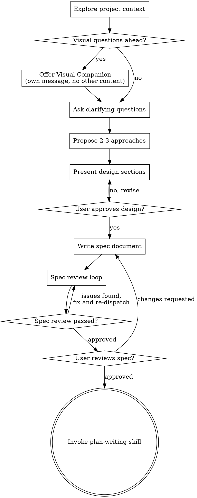

# Spec Writing

Turn ideas into structured, reviewable specification documents through collaborative dialogue. This skill handles the full arc: understanding the problem, exploring approaches, designing the solution, and writing the spec. It can also be invoked directly when requirements are already known and you just need to produce the document.

<HARD-GATE>
Do NOT invoke any implementation skill, write any code, scaffold any project, or take any implementation action until you have presented a design and the user has approved it. This applies to EVERY project regardless of perceived simplicity.
</HARD-GATE>

## Anti-Pattern: "This Is Too Simple To Need A Spec"

Every project goes through this process. A todo list, a single-function utility, a config change — all of them. "Simple" projects are where unexamined assumptions cause the most wasted work. The spec can be short (a few sentences for truly simple projects), but you MUST present it and get approval.

## Checklist

You MUST create a task for each of these items and complete them in order:

1. **Explore project context** — check files, docs, recent commits
2. **Offer visual companion** (if topic will involve visual questions) — this is its own message, not combined with a clarifying question. See the Visual Companion section below.
3. **Ask clarifying questions** — one at a time, understand purpose/constraints/success criteria
4. **Propose 2-3 approaches** — with trade-offs and your recommendation
5. **Present design** — in sections scaled to their complexity, get user approval after each section
6. **Write spec document** — save to `<PRIMARY_REPO_ROOT>/design/<status>-YYYYMMDDHHMM-<topic>-spec-01.md`
7. **Spec review loop** — dispatch spec-document-reviewer subagent with precisely crafted review context (never your session history); fix issues and re-dispatch until approved (max 3 iterations, then surface to human)
8. **User reviews written spec** — ask user to review the spec file before proceeding
9. **Transition to implementation** — invoke plan-writing skill to create implementation plan

## Process Flow

**The terminal state is invoking plan-writing.** Do NOT invoke frontend-design, mcp-builder, or any other implementation skill. The ONLY skill you invoke after spec-writing is plan-writing.

## The Process

**Understanding the idea:**

- Check out the current project state first (files, docs, recent commits)
- Before asking detailed questions, assess scope: if the request describes multiple independent subsystems (e.g., "build a platform with chat, file storage, billing, and analytics"), flag this immediately. Don't spend questions refining details of a project that needs to be decomposed first.
- If the project is too large for a single spec, help the user decompose into sub-projects: what are the independent pieces, how do they relate, what order should they be built? Then spec the first sub-project through the normal flow. Each sub-project gets its own spec -> plan -> implementation cycle.
- For appropriately-scoped projects, ask questions one at a time to refine the idea
- Prefer multiple choice questions when possible, but open-ended is fine too
- Only one question per message - if a topic needs more exploration, break it into multiple questions
- Focus on understanding: purpose, constraints, success criteria

**Exploring approaches:**

- Propose 2-3 different approaches with trade-offs
- Present options conversationally with your recommendation and reasoning
- Lead with your recommended option and explain why

**Presenting the design:**

- Once you believe you understand what you're building, present the design
- Scale each section to its complexity: a few sentences if straightforward, up to 200-300 words if nuanced
- Ask after each section whether it looks right so far
- Cover: architecture, components, data flow, error handling, testing
- Be ready to go back and clarify if something doesn't make sense

**Design for isolation and clarity:**

- Break the system into smaller units that each have one clear purpose, communicate through well-defined interfaces, and can be understood and tested independently
- For each unit, you should be able to answer: what does it do, how do you use it, and what does it depend on?
- Can someone understand what a unit does without reading its internals? Can you change the internals without breaking consumers? If not, the boundaries need work.
- Smaller, well-bounded units are also easier for you to work with - you reason better about code you can hold in context at once, and your edits are more reliable when files are focused. When a file grows large, that's often a signal that it's doing too much.

**Working in existing codebases:**

- Explore the current structure before proposing changes. Follow existing patterns.
- Where existing code has problems that affect the work (e.g., a file that's grown too large, unclear boundaries, tangled responsibilities), include targeted improvements as part of the design - the way a good developer improves code they're working in.
- Don't propose unrelated refactoring. Stay focused on what serves the current goal.

## Writing the Spec Document

A spec is a contract between the person who designed the feature and the person (or agent) who will implement it. Write it so someone with zero context can build the right thing without asking follow-up questions.

### Required Sections

Every spec must include these sections. Scale length to complexity — a trivial feature might have one sentence per section, a complex one might have paragraphs.

| Section | Purpose | What belongs here |
|---------|---------|-------------------|
| **Overview** | One paragraph explaining what this builds and why | The elevator pitch — what problem it solves, who benefits, why now |
| **Interfaces** | Concrete inputs and outputs | CLI commands with flags, API endpoints with request/response shapes, function signatures, UI wireframes — whatever the user or calling code touches directly |
| **Architecture** | How the system is structured internally | Layer separation, module responsibilities, which files own what, data flow between components |
| **Data Flow** | How data moves through the system end-to-end | From trigger to final state — include transformations, validations, and side effects at each step |
| **Error Handling** | What goes wrong and how the system responds | Table format preferred: error condition, source, behavior. Cover auth failures, invalid input, external service failures, and conflict/race conditions |
| **File Structure** | Which files are created or modified | Tree view showing the directory layout with brief annotations |
| **Testing & Validation** | How to verify the implementation works | Manual test steps, automated test expectations, edge cases to monitor |
| **Success Criteria** | How to know when you're done | Observable, testable outcomes — not vague goals like "works well" |

### Optional Sections

Include these when relevant:

| Section | When to include |
|---------|-----------------|
| **Trigger & Scope** | When the feature is event-driven (webhooks, cron, CI triggers) — clarify what fires and what's filtered out |
| **Auth & Secrets** | When external credentials are involved — which secrets, where they're stored, how they're accessed |
| **Reuse from Existing Code** | When adapting patterns or logic from elsewhere in the codebase — cite specific files and what's being reused |
| **Future Considerations** | When there are obvious follow-ups you're intentionally deferring — label them as Phase 2+ to prevent scope creep |

### Spec Quality Standards

**Be concrete, not abstract.** A spec that says "the CLI accepts user input and processes it" is useless. A spec that says `elvis attio people add <email> [--first-name] [--last-name]` is implementable.

**Show the shape of things.** Include example CLI output, API response JSON, data structures, or error messages. The implementer shouldn't have to guess what the output looks like.

**Name every file.** Don't say "add a new module for handling X." Say `libs/x/handler.py` with its responsibility. If you don't know the exact path yet, that's a signal the architecture section needs more thought.

**Error handling is not optional.** Every external dependency is a failure point. Every user input is a validation opportunity. List them. If the spec has no error handling section, it's incomplete.

**Success criteria must be testable.** "Tickets appear in Linear within 30 seconds of comment" is testable. "The system works reliably" is not. Each criterion should be something you can point at and say "yes, this happened" or "no, it didn't."

**Scope aggressively.** If a feature has obvious Phase 2 extensions, name them in Future Considerations and explicitly exclude them from the current spec. This prevents scope creep during implementation.

### Common Spec Pitfalls

- **Vague interfaces** — describing what a command "does" without showing its exact flags, arguments, and output format
- **Missing error paths** — only describing the happy path and leaving the implementer to guess at failure behavior
- **Architecture by implication** — assuming the reader knows your codebase conventions without stating which files go where
- **Untestable criteria** — success conditions that require subjective judgment instead of observable outcomes
- **Scope leaks** — describing Phase 2 features in the same breath as Phase 1 without clear boundaries
- **Copy-paste from conversation** — dumping the brainstorming discussion into the spec instead of distilling it into structured sections

### Writing Style

- Lead with what matters: the overview should tell someone in 30 seconds whether this spec is relevant to them
- Use tables for structured data (error handling, file structure, command flags) — walls of prose are harder to scan
- Use code blocks for anything the implementer will type or see: commands, output, data structures, file paths
- Keep prose tight — if a section can be a table or a list, prefer that over paragraphs
- Use heading hierarchy consistently: `##` for top-level sections, `###` for subsections

## After the Design

**Documentation:**

- Write the validated design (spec) to `<PRIMARY_REPO_ROOT>/design/<status>-YYYYMMDDHHMM-<topic>-spec-01.md`
- Resolve canonical path before writing:
  - `PRIMARY_REPO_ROOT="$(dirname "$(git rev-parse --git-common-dir)")"`
  - `DESIGN_DIR="$PRIMARY_REPO_ROOT/design"`
- Never save specs to `worktrees/*/design/` or `.worktrees/*/design/`.
- If new requirements are still within the approved scope, edit the current spec file.
- If new requirements are out of scope and deferred, create the next indexed follow-up spec (`-02`, `-03`, ...).
- Use elements-of-style:writing-clearly-and-concisely skill if available
- Ask the user to review the spec before committing (let them request changes first)

**Spec Review Loop:**
After writing the spec document:

1. Dispatch spec-document-reviewer subagent (see spec-document-reviewer-prompt.md)
2. If Issues Found: fix, re-dispatch, repeat until Approved
3. If loop exceeds 3 iterations, surface to human for guidance

**User Review Gate:**
After the spec review loop passes, ask the user to review the written spec before proceeding:

> "Spec written and committed to `<path>`. Please review it and let me know if you want to make any changes before we start writing out the implementation plan."

Wait for the user's response. If they request changes, make them and re-run the spec review loop. Only proceed once the user approves.

**Implementation:**

- Invoke the plan-writing skill to create a detailed implementation plan
- Do NOT invoke any other skill. plan-writing is the next step.

## Key Principles

- **One question at a time** - Don't overwhelm with multiple questions
- **Multiple choice preferred** - Easier to answer than open-ended when possible
- **YAGNI ruthlessly** - Remove unnecessary features from all designs
- **Explore alternatives** - Always propose 2-3 approaches before settling
- **Incremental validation** - Present design, get approval before moving on
- **Be flexible** - Go back and clarify when something doesn't make sense

## Visual Companion

A browser-based companion for showing mockups, diagrams, and visual options during spec writing. Available as a tool — not a mode. Accepting the companion means it's available for questions that benefit from visual treatment; it does NOT mean every question goes through the browser.

**Offering the companion:** When you anticipate that upcoming questions will involve visual content (mockups, layouts, diagrams), offer it once for consent:
> "Some of what we're working on might be easier to explain if I can show it to you in a web browser. I can put together mockups, diagrams, comparisons, and other visuals as we go. This feature is still new and can be token-intensive. Want to try it? (Requires opening a local URL)"

**This offer MUST be its own message.** Do not combine it with clarifying questions, context summaries, or any other content. The message should contain ONLY the offer above and nothing else. Wait for the user's response before continuing. If they decline, proceed with text-only spec writing.

**Per-question decision:** Even after the user accepts, decide FOR EACH QUESTION whether to use the browser or the terminal. The test: **would the user understand this better by seeing it than reading it?**

- **Use the browser** for content that IS visual — mockups, wireframes, layout comparisons, architecture diagrams, side-by-side visual designs
- **Use the terminal** for content that is text — requirements questions, conceptual choices, tradeoff lists, A/B/C/D text options, scope decisions

A question about a UI topic is not automatically a visual question. "What does personality mean in this context?" is a conceptual question — use the terminal. "Which wizard layout works better?" is a visual question — use the browser.

If they agree to the companion, read the detailed guide before proceeding:
`skills/spec-writing/visual-companion.md`
